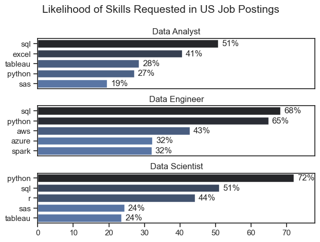
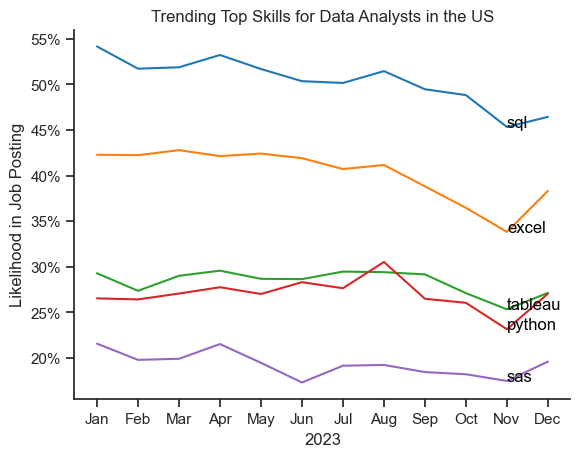
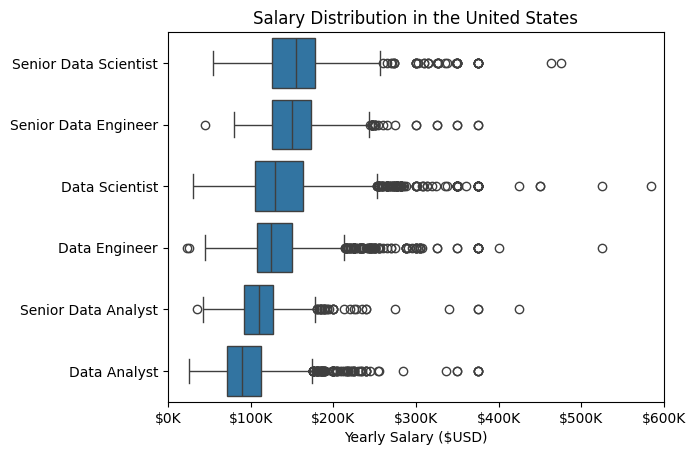
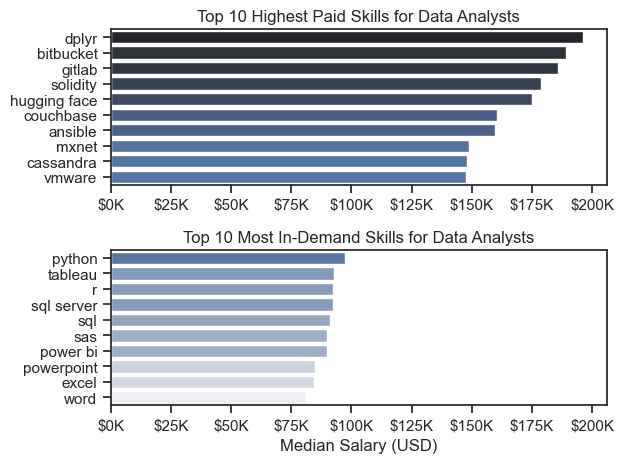
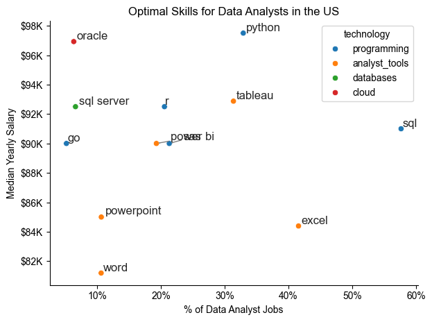

# Overview
Welcome to my analysis of the data job market, focusing on data analyst roles. This project was done thanks to Luke Barousse's youtube (11 whopping hour) guide. This analysis tackles Data Analysis skills in the US, and highlights the most popular and highest-paid skills.

Data and code comes from Luke's Python Course too, containing information he managed to scrape from linkedin and other sources regarding job postings related to Data Nerds. It contains information about Job Title, Salary, Skills mentioned and more. Using a series of python scripts from Luke's course I manged to outline trends in the Data Analysis job market, and show the relationship between salary, skills, positions, and time of year.
# The Questions
Below are the questions I want to answer in my project:

What are the skills most in demand for the top 3 most popular data roles?
How are in-demand skills trending for Data Analysts?
How well do jobs and skills pay for Data Analysts?
What are the optimal skills for data analysts to learn? (High Demand AND High Paying)
# Tools I Used
For my deep dive into the data analyst job market, I harnessed the power of several key tools:

- Python: The backbone of my analysis, allowing me to analyze the data and find critical insights.I also used the following Python libraries:
    - Pandas Library: This was used to analyze the data.
    - Matplotlib Library: I visualized the data.
    - Seaborn Library: Helped me create more advanced visuals.
- Jupyter Notebooks: The tool I used to run my Python scripts which let me easily include my notes and analysis.
- Visual Studio Code: My go-to for executing my Python scripts.
- Git & GitHub: Essential for version control and sharing my Python code and analysis, ensuring collaboration and project tracking.
# Data Preparation and Cleanup
This section outlines the steps taken to prepare the data for analysis, ensuring accuracy and usability.

Import & Clean Up Data
I start by importing necessary libraries and loading the dataset, followed by initial data cleaning tasks to ensure data quality.

# Importing Libraries
import ast
import pandas as pd
import seaborn as sns
from datasets import load_dataset
import matplotlib.pyplot as plt  

# Loading Data
dataset = load_dataset('lukebarousse/data_jobs')
df = dataset['train'].to_pandas()

# Data Cleanup
df['job_posted_date'] = pd.to_datetime(df['job_posted_date'])
df['job_skills'] = df['job_skills'].apply(lambda x: ast.literal_eval(x) if pd.notna(x) else x)
Filter US Jobs
To focus my analysis on the U.S. job market, I apply filters to the dataset, narrowing down to roles based in the United States.

df_US = df[df['job_country'] == 'United States']

# The Analysis

## 1. What are the most demanded skills for the top 3 most popular data roles?

To find the most demanded skills for the top 3 most popular data roles I fltered out the most popular positions, and got the top 5 skills for the top 3 roles. This query highlights the most popular job titles and their top skills , showing which skills Data Analysts should pay attention to depending on the role they're targeting.

View my notebook with detailed steps here: [Skill_Demand.ipynb](PYTHON_DATA_PROJECT/3_Project/2_Skill_Demand.ipynb)


### Visualize Data 

```python
fig, ax = plt.subplots(len(job_titles), 1)


for i, job_title in enumerate(job_titles):
    df_plot = df_skills_count[df_skills_count['job_title_short'] == job_title].head(5)[::-1]
    sns.barplot(data=df_plot, x='skill_count', y='job_skills', ax=ax[i], hue='skill_count', palette='dark:b_r')

plt.show()
```

### Results



### Insights

- Python is a versatile and highly demanded skill across all 3 roles. Most prominent for Data scientists and Data Engineers where it is 72% and 65% likely to appear in a job posting.
- SQL is most requested for Data Analysts and Data Scientists with half of all job postings having it as a skill. It's essential for Data Engineers appearing in 68% of job postings.
- Data Engineers tend to require more specialized knowledge of cloud coding (AWS, Azure, Spark) compared to Analysts and Scientists, who are expected to be profficient in more general data management tools (Excel Tableu) etc.

## 2. What are the in-demand skills for data analysts, what is their trend?

### Visualize Data

```python


df_plot = df_DA_US_percent.iloc[:, :5]
sns.lineplot(data=df_plot, dashes=False, palette='tab10', legend='full')

from matplotlib.ticker import PercentFormatter
ax = plt.gca()
ax.yaxis.set_major_formatter(PercentFormatter(decimals=0))

plt.show()
```
### Results
*Line chart visualizing the trending top skills for data analysts in the US in 2023.*

### Insights:
- SQL is the most demanded skill and remains so for the whole year, but there was a decrease in demand towards end of 2023.
- Excel was also highly saught, and came in 2nd, also dropped down as the year went on.
- Python and Tableu fight for 3rd place and remain in a similar bracket of 25-30% of Data Analyst job postings. sas is the 5th most demanded, but it's relatively low.

## 3. How well do jobs and skills pay for Data Analysts?

### Salary Analysis for Data Nerds
#### Visualie Data

```python
sns.boxplot(data=df_US_top6, x='salary_year_avg', y='job_title_short', order = job_order)

ax = plt.gca()
ax.xaxis.set_major_formatter(plt.FuncFormatter(lambda x, pos: f'${int(x/1000)}K'))
plt.xlim(0,600000)
plt.show()

```

#### Results

*Box plot visualizaing the salary distributions for the top 6 data job titles in the US*

#### Insights
- As the boxplot graph shows there's a lot of variation between pay across different job titles. Senior Data Scientist and Senior Data Engineers have the highest salaries and higher top-end of salaries. This is indicative of higher value of experience and advanced skills.
- Data Analysts earn the least, and have the least high-earner outliers. Moreover, Senior Analysts tend to earn less then even junior Data Engineers and Data Scientists. Indicating that Data Analysis in the basic form is not valued as high as some other skills.
- Median salaries diverge from outliers quite a lot for Data Scientists and Engineers demonstrating that despite most values being cose to the median, there are a lot of people who earn more (and also less). PS Data analysts have fewer outliers.

### Highest Paid & Most in-demand skills for Data Analysts
#### Visualize Data

```Python
#top 10 highest paying skills for DA
sns.barplot(data=df_DA_top_pay, x='median', y=df_DA_top_pay.index, ax=ax[0], hue='median', palette='dark:b_r')

#top 10 most popular skills in DA
sns.barplot(data=df_DA_skills, x='median', y=df_DA_skills.index, ax=ax[1], hue='median', palette='light:b')

```

*Two separate bar charts visualizing the highest-paid skills and most in-demand skills for data analysts in the US*

#### Insights
- The top graph shows that specialized skills such as `dplyr`, `bitbucket` and `gitlab` are associated with highest sallaries up to $200k median. Despite the high salary, these job postings are rather rare to find.

- The bottom graph highlights that foundational data analysis skills such as `excel`, `powerpoint` and `sql` are still some of the most-often demanded ones. Additionally, knowledge of `R` and `python` certainly would not harm your chances.

- Now even though there is a clear distinction between the two brackets of skills, a Data Nerd should always start with the basics. To develop towards a higher-paying skill down the road certainly isn't something unimaginable as well. Just don't remember that sometimes you still need to learn how to walk before running.

## 4. What is the most optimal skill to learn for Data Analysts?

#### Visualize Data

```python

sns.scatterplot(
    data=df_plot,
    x='skill_percent',
    y='median_salary',
    hue='technology'
)

# prepare text for adjustText
texts=[]
for i, txt in enumerate(df_DA_skills_high_demand.index):
    texts.append(plt.text(df_DA_skills_high_demand['skill_percent'].iloc[i], df_DA_skills_high_demand['median_salary'].iloc[i], txt))

# adjust text to avoid overlap
from adjustText import adjust_text
adjust_text(texts, arrowprops=dict(arrowstyle="->", color='gray', lw=1))

# adust axis format
from matplotlib.ticker import PercentFormatter
ax = plt.gca()
ax.yaxis.set_major_formatter(plt.FuncFormatter(lambda y, pos: f'${int(y/1000)}K'))
ax.xaxis.set_major_formatter(PercentFormatter(decimals=0))

plt.tight_layout()
plt.show()

```

#### Results

*A scatterplot visualizing the most popular and highest paying skills for Data analysts in the US.*

#### Analysis
- Scatterplot highlights how programming skills are most optimal to have. If you know skills like `python`, `sql` and `r` then you'll find jobs more easily AND get paid more.
- Analyst tools (colored orange) such as `excel`, `powerpoint`, `tableau` and `word` are still very popular. Despite it being crucial and paying relatively well, it's far behind programming.
- How do I earn the most? Well. Learn cloud and databases: `oracle` and `sql server` in our example. This indicates the skill gap and demand for experts in data management and cloud computing. 

# What I Learned
I came in with little to no understanding about python, I just knew it's used in data analytics. In a nutshell, now I see that unlike R it can be used for a lot more (than just data manipulation and statistics) and make both analysis quickly, and create beautiful visualizations. But here's what I learned:

Advanced Python Usage: Libraries are KEY. Yes, if you need to know how to use them, but man they make your life easy and help with better visualizations. Pandas are for data, Matplotlib and Seaborn are for visualization and graphing.

Data Cleaning Importance: Nothing new perhaps, but I got to see firsthand how effort into data cleaning pays dividends later.

Strategic Skill Analysis: I learned how US job market is an interesting example of what happens throughout the world. Programming is more efficient and it pays. Additionally you get paid more if you do a great job, and less so if you just change the job (eg Data Analyst vs Data Scientist).
# Insights
This project provided several general insights into the data job market for analysts:

Skill Demand and Salary Correlation: There is a clear correlation between the demand for specific skills and the salaries these skills command. Advanced and specialized skills like Python and Oracle often lead to higher salaries.
Market Trends: There are changing trends in skill demand, highlighting the dynamic nature of the data job market. Keeping up with these trends is essential for career growth in data analytics.
Economic Value of Skills: Understanding which skills are both in-demand and well-compensated can guide data analysts in prioritizing learning to maximize their economic returns.
# Challenges I Faced
This project was not without its challenges, but it provided good learning opportunities:

Data Inconsistencies: Handling missing or inconsistent data entries requires careful consideration and thorough data-cleaning techniques to ensure the integrity of the analysis.
Complex Data Visualization: Designing effective visual representations of complex datasets was challenging but critical for conveying insights clearly and compellingly.
Balancing Breadth and Depth: Deciding how deeply to dive into each analysis while maintaining a broad overview of the data landscape required constant balancing to ensure comprehensive coverage without getting lost in details.
# Conclusion
This exploration into the data analyst job market has been incredibly informative, highlighting the critical skills and trends that shape this evolving field. The insights I got enhance my understanding and provide actionable guidance for anyone looking to advance their career in data analytics. As the market continues to change, ongoing analysis will be essential to stay ahead in data analytics. This project is a good foundation for future explorations and underscores the importance of continuous learning and adaptation in the data field.
